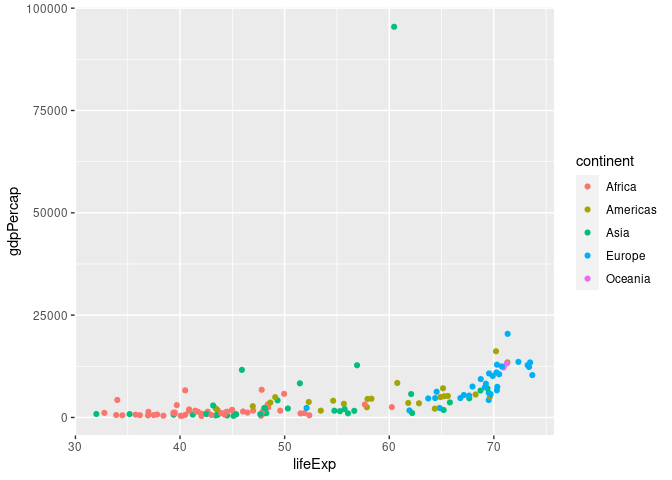

Data Visualization -Gapminder dataset
================
Eric Anje
2022-07-17

``` r
#calling libraries
library(gapminder)
library(dplyr, warn.conflicts = F)
library(ggplot2)
library(tidyverse)
```

## Looking at the first six observations

``` r
gapminder %>% head()
```

    ## # A tibble: 6 × 6
    ##   country     continent  year lifeExp      pop gdpPercap
    ##   <fct>       <fct>     <int>   <dbl>    <int>     <dbl>
    ## 1 Afghanistan Asia       1952    28.8  8425333      779.
    ## 2 Afghanistan Asia       1957    30.3  9240934      821.
    ## 3 Afghanistan Asia       1962    32.0 10267083      853.
    ## 4 Afghanistan Asia       1967    34.0 11537966      836.
    ## 5 Afghanistan Asia       1972    36.1 13079460      740.
    ## 6 Afghanistan Asia       1977    38.4 14880372      786.

``` r
filter(gapminder, year == 1962) %>%
  ggplot(aes(lifeExp, gdpPercap,color=continent)) +
  geom_point()
```

<!-- -->

``` r
g1 <- ggplot(gapminder, aes(x = gdpPercap, y = lifeExp, color = continent, size =pop)) +
  geom_point() + scale_x_log10()
g1 + theme(legend.position = "top")+ggtitle("GDP vs Life Expectancy")
```

<!-- -->

``` r
g2 <- ggplot(gapminder, aes(x = continent, y = gdpPercap, fill = continent))+
geom_boxplot(alpha = 0.5) 
g2 + labs(x = 'Continent', y = 'GDP per Capita [in USD]', title = "GDP per capita per continent")
```

<!-- -->

``` r
filter(gapminder, year %in% c(1962, 2002)) %>%
   ggplot(aes(pop, gdpPercap, col = continent)) +
    geom_point() +
    facet_grid(. ~ year)
```

<!-- -->

``` r
filter(gapminder, year %in% c(1962, 2002)) %>%
    ggplot(aes(pop, gdpPercap, col = continent)) +
    geom_point() +
    facet_grid(continent ~ year)
```

<!-- -->

``` r
gapminder %>%
    filter(country %in%  c("Kenya","Uganda","Tanzania")) %>%
    ggplot(aes(year, pop,col=country)) +
    geom_point()+ggtitle("East Africa Population Trend",subtitle = "Erc scatter")
```

<!-- -->

``` r
gapminder %>%
    filter(country %in%  c("Kenya","Uganda","Tanzania")) %>%
    ggplot(aes(year, pop,col=country)) +
    geom_line()+ggtitle("East Africa Population Trend",subtitle = "Erc scatter")
```

<!-- -->

``` r
ggplot(data = gapminder) +
  geom_smooth(mapping = aes(x = log(gdpPercap), 
                            y = lifeExp, 
                            colour = continent))+ggtitle("Scatter: Life expectancy vs GDP by continent")
```

<!-- -->

### composite plots

``` r
ggplot(data = gapminder) +
  geom_point(mapping = aes(x = log(gdpPercap), y = lifeExp,colour=continent)) +
  geom_smooth(mapping = aes(x = log(gdpPercap), y = lifeExp,colour=continent))
```

<!-- -->

``` r
ggplot(data=gapminder, aes(x=lifeExp)) + 
    geom_density(size=1.5, fill="yellow", alpha=0.5) +
    geom_histogram(aes(y=..density..), binwidth=4, color="black", fill="purple", alpha=0.5)
```

<!-- -->

``` r
ggplot(data=gapminder, aes(x=lifeExp, fill=continent)) +
    geom_density(alpha=0.6)
```

<!-- -->
